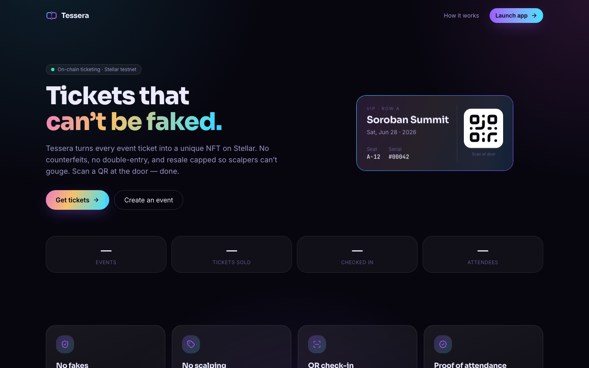
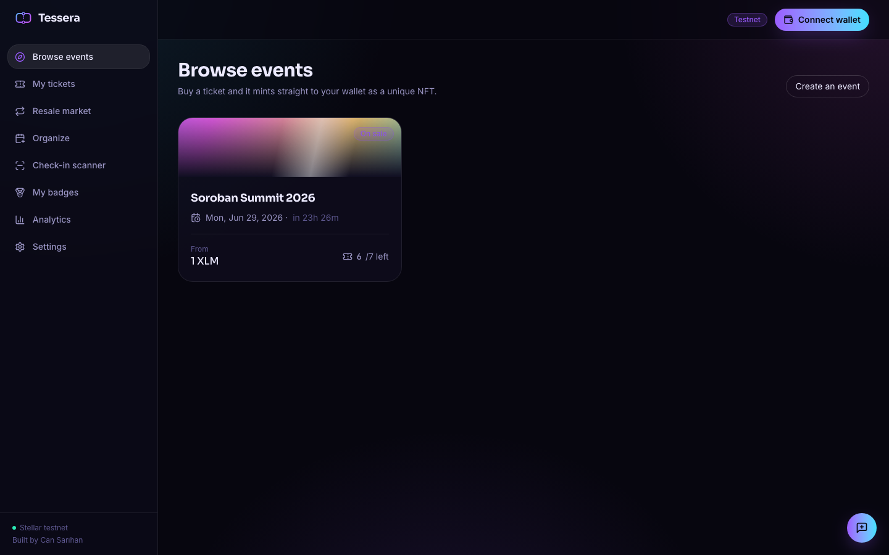
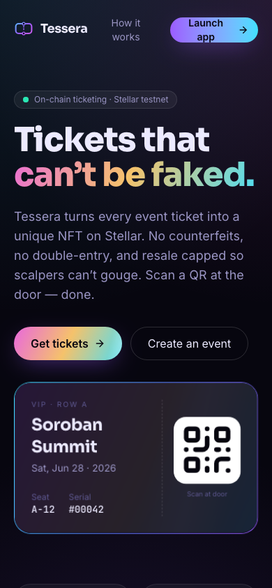

<div align="center">

# 🎟️ Tessera

### On-chain event ticketing on Stellar — impossible to counterfeit, capped against scalping

Every ticket is a unique NFT on Soroban. Buy it to your wallet, show a QR at the door, and the
organizer verifies it on-chain and marks it used — so a ticket can’t be faked, copied, or used
twice. Resale is price-capped on-chain, so scalpers can’t gouge.

**[🚀 Live demo](https://cansarihan.github.io/tessera/)** ·
**[📊 Pitch deck](docs/pitch-deck.md)** ·
**[🎬 Demo video](#-demo)** ·
**[🔗 Contract on testnet](https://stellar.expert/explorer/testnet/contract/CBPKPVNYRW6HS7ZZYAB6QZ45FHJTA2XWJBAPWTV2R5UBED4SCROPMLFG)**

Built by **Can Sarıhan**



</div>

---

## The problem

Event ticketing is broken in two ways: **fakes** (counterfeit, screenshotted or double-sold tickets)
and **scalping** (bots buy out inventory and resell at huge markups). Both hurt fans and organizers,
and the trust gap is filled by expensive intermediaries.

## The solution

Tessera makes each ticket a **unique, on-chain NFT** and enforces the rules in a Soroban contract:

| | |
|---|---|
| 🛡️ **No fakes** | Ownership is on-chain; check-in permanently marks the ticket `used`, so it can’t be reused or copied. |
| 🏷️ **No scalping** | Resale is capped at a max price set by the organizer, enforced by the contract. |
| 📲 **QR check-in** | The door scans a QR; the app verifies the holder owns a valid, unused ticket and stamps it. |
| 🏅 **Proof of attendance** | Checking in mints a collectible POAP badge to the attendee’s wallet. |
| 🎫 **Tiers & seating** | Multiple price tiers (GA / VIP) with optional unique seat assignment. |
| ♻️ **Fair resale market** | A built-in secondary market where every listing respects the price cap. |

## Screenshots

| Browse & buy | Mobile |
|---|---|
|  |  |

## Architecture

```
tessera/
├── contracts/tessera   Soroban (Rust) — events, NFT tickets, capped resale, check-in, POAP
├── packages/sdk        TypeScript SDK — typed client + QR payload helpers
├── apps/api            Express + libSQL (Turso) — indexer, REST, feedback, analytics, onboarding
└── apps/web            React + Vite + Tailwind — the "Holographic" UI
```

- **Contract** holds the source of truth: events, tiers, tickets (NFTs), resale cap, check-in state.
- **SDK** wraps reads (simulation) and wallet-signed writes, plus QR encode/decode.
- **API** indexes the chain into Turso for fast stats/activity and stores feedback + onboarding data.
- **Web** reads tickets/events straight from the contract (always fresh) and aggregates from the API.

## How it works

1. **Create an event** — organizer sets tiers, supply and a resale cap. Tickets mint on demand.
2. **Fans buy** — each purchase mints an NFT ticket straight to the buyer’s wallet (≈1 transaction).
3. **Scan & attend** — at the door the organizer scans the QR; the app verifies ownership on-chain,
   marks the ticket used (no double-entry) and mints a POAP badge.
4. **Resale, capped** — holders can list within the organizer’s cap; the contract rejects anything higher.

## Tech stack

Soroban (Rust, soroban-sdk 25) · `@stellar/stellar-sdk` 16 · TypeScript · Express · libSQL/Turso ·
React 18 · Vite 6 · Tailwind v4 · TanStack Query · framer-motion · recharts · Stellar Wallets Kit.

## Local development

```bash
npm install
npm run build:sdk

# contract
npm run contract:test
npm run contract:build

# app (API on :8788, web on :5273)
npm run dev
```

Copy `apps/web/.env.example` and `apps/api/.env.example` to `.env` to override defaults.

## Deployment

- **Web** → GitHub Pages (`.github/workflows/deploy-pages.yml`, base `/tessera/`).
- **API** → Render (`render.yaml`, Docker) with **Turso** for persistent storage. Turso credentials
  are set in the Render dashboard, never committed.
- **Contract** → Stellar testnet: `CBPKPVNYRW6HS7ZZYAB6QZ45FHJTA2XWJBAPWTV2R5UBED4SCROPMLFG`

---

## 🎬 Demo

> Full walkthrough — create an event, buy a ticket, scan at the door, mint a POAP badge.

_Demo video link: coming soon._

## 📈 Growth & validation (Level 5)

- **Real users** — onboarded testnet users with real wallet interactions. Verify every event,
  purchase and check-in on
  [stellar.expert](https://stellar.expert/explorer/testnet/contract/CBPKPVNYRW6HS7ZZYAB6QZ45FHJTA2XWJBAPWTV2R5UBED4SCROPMLFG).
- **User details form** — a [Google Form](https://docs.google.com/forms/d/e/1FAIpQLSdeumsCeoZpgwMx-bcD1A3mNk20CPh_OLEJDOkt3ovxMg4IoQ/viewform) collects wallet, email, name and a product rating.
  The same fields are also collected in-app (Settings → *Join the pilot*) and exported to a sheet via
  `GET /api/onboard/export.csv`. Exported responses: [`docs/users.csv`](docs/users.csv).
- **Feedback** — collected through the in-app widget and summarized live on the **Analytics** page.

### How we’re improving Tessera from feedback

Tessera evolves with what users tell us. Each improvement links the commit that delivered it:

| Feedback theme | Improvement | Commit |
|---|---|---|
| “Is resale safe from scalpers?” | On-chain resale price cap + fair secondary market | [`0963c14`](https://github.com/cansarihan/tessera/commit/0963c14) |
| “Checking in should be instant” | One-tap QR scanner with on-chain verification | [`bba2090`](https://github.com/cansarihan/tessera/commit/bba2090) |
| “Make it usable on my phone” | Fully responsive Holographic UI | [`bba2090`](https://github.com/cansarihan/tessera/commit/bba2090) |
| “I want a memento of events I attended” | POAP attendance badges minted on check-in | [`0963c14`](https://github.com/cansarihan/tessera/commit/0963c14) |

**Next from feedback:** event posters/images, email reminders before an event, organizer payout
analytics, and Apple/Google Wallet passes. (Updated each cycle as new responses arrive.)

## License

MIT © Can Sarıhan
